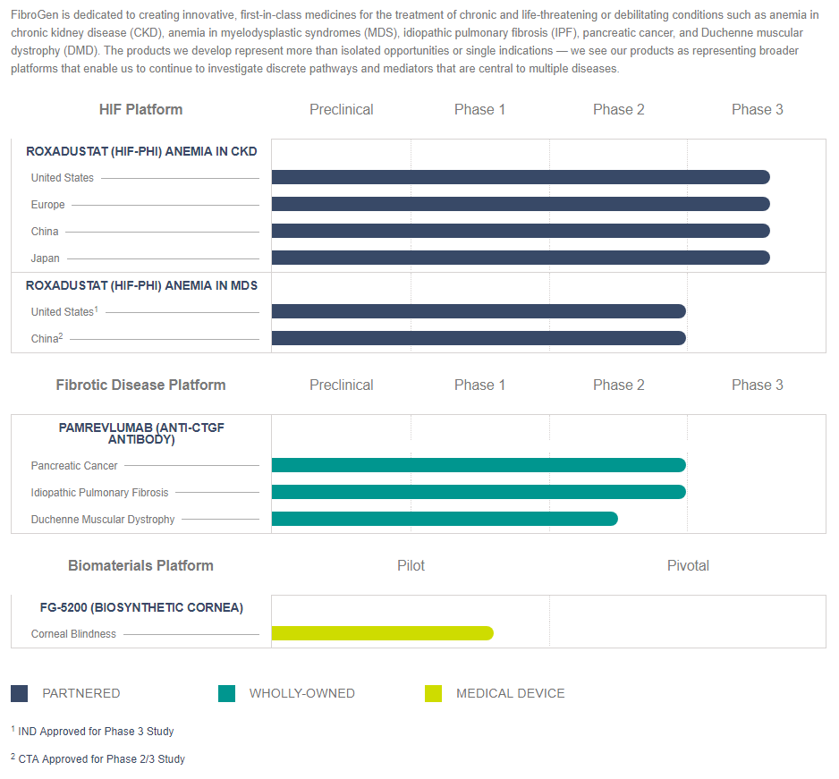

# Summary

**Company**: [FibroGen](http://www.fibrogen.com/)

**Ticker**: NASDAQ:FGEN

**Price**: $39.67 (14/09/2018) / **52w Low**: $38.52 / **52w High**: $68.55

**Market Cap**: $3.3B (14/09/2018)

**Institutional Ownership**: 67.79% (Q3 2018)

**Cash**: $716.5M (Q3 2018)

**Debt**: $365M (Q3 2018) / **Current Liabilities**: $100M (Q3 2018)

**Burn**: $280M (2018)

**Revenues for Milestones**: $100M (9 months 2018)

**Received/Pending Revenues for Milestones**: $900M/$1.6B (Q3 2018)

## Catalyst

* Roxadustat:
    * U.S. and European CKD anemia programs completed treatment of all Phase 3 patients, topline individual study results in the Q4 2018, NDA 1H 2019
    * China, NMPA approval decision for anemia DD-CKD NDA in China by end 2018. Anemia in NDD-CKD will be added to the label in the 1H 2019
    * Japan, NDA filled

* Pamrevlumab (FG-3019):
    * Begin enrolling Phase 3 neoadjuvant therapy for pancreatic cancer 260 patients in 1Q 2019
    * Begin enrolling Phase 3 trial 500 IPF patients 1Q 2019. PE endpoint of change from baseline in forced vital capacity (FVC)
    * In DMD, all 21 non-ambulatory patients from our fully enrolled Phase 2 trial will have completed one year of study in March 2019.

## Pipeline

[Pipeline](http://www.fibrogen.com/pipeline/):

## Business Overview

We were incorporated in 1993 in Delaware and are a biopharmaceutical company discovering and developing first-in-class therapeutics. Roxadustat (FG4592), our most advanced product candidate, is an oral small molecule inhibitor of hypoxia inducible factor (“HIF”) prolyl hydroxylase (“HIF-PH”) activity in Phase 3 clinical development for the treatment of anemia in chronic kidney disease (“CKD”) and myelodysplastic syndromes (“MDS”). Pamrevlumab (FG3019), a human monoclonal antibody that inhibits the activity of connective tissue growth factor (“CTGF”) is in Phase 2 clinical development for the treatment of idiopathic pulmonary fibrosis (“IPF”), pancreatic cancer, and Duchenne muscular dystrophy (“DMD”). We are taking a global approach to the development and future commercialization of our product candidates, and this includes development and commercialization in the People’s Republic of China (“China”). We are capitalizing on our extensive experience in fibrosis and HIF biology and clinical development to advance a pipeline of innovative medicines for the treatment of anemia, fibrotic disease cancer, corneal blindness and other serious unmet medical needs.

## Partners

Effective July 30, 2013, the Company entered into a collaboration agreement with AstraZeneca AB for the development and commercialization of roxadustat for the treatment of anemia in the U.S. and all other countries in the world, other than China, not previously licensed under the Astellas Europe and Astellas Japan Agreements.

AstraZeneca will pay the Company tiered royalty payments on AstraZeneca’s future net sales (as defined in the agreement) of roxadustat in the low 20% range. In addition, the Company will receive a transfer price for delivery of commercial product based on a percentage of AstraZeneca’s net sales (as defined in the agreement) in the low- to mid-single digit range.

The China Agreement is structured as a 50/50 profit or loss share (as defined) and provides for joint development costs (including capital and equipment costs for construction of the manufacturing plant in China), to be shared equally during the development.

## Info

[biomaven 01/01/2017](https://www.siliconinvestor.com/readmsg.aspx?msgid=30913902&srchtxt=fgen%20china)

Roxadustat. As for the commercial opportunity, this has been seriously underestimated by the market. This is a 50:50 deal with AZN, with AZN providing all funding to be repaid out of sales.

The size of the Chinese market (in patient population terms) is simply mind boggling. 120 million CKD patients, of which some 20 million are stage 3 or later. There are now as many dialysis patients as there are in the US, with the number growing at better than 20% annually. Anemia is very seriously under-treated as the system is simply not set up for large numbers of infusions of epo (particularly for ND patients). Transfusions are pretty much non-existent as there is a big blood shortage. Epo in China costs maybe $1500 per year, although most patients don't get consistent treatments. So $1k per year (50% discount on epo) might be a reasonable target price, although who knows how the Chinese government might react once the patient numbers start climbing. (Price will be set by government, not company, as this will be a reimbursed product). In any event, it's not hard to see this as a significant blockbuster with a huge potential market and very little competition for years.

There is also the clear opportunity for label expansion, first in MDS and then in chemo-induced anemia. Both these requests were initiated by the Chinese regulators. It's pretty clear the Chinese FDA views roxa as something of a flagship product - potentially the first significant foreign drug to be approved first in China. So I could see them being on their best behavior - of course not something you want from a regulatory agency from a policy perspective, but still good for the company here.

Bottom line, while analysts somehow focus on China mostly as some sort of clue about how the US/ROW phase III's might come out, they are very much missing the key point here - this is a low risk opportunity for a billion dollar or better product with 50:50 economics.

## Studies

### Roxadustat

Roxadustat, the most advanced HIF-PH inhibitor in clinical development, acts by stimulating the body’s natural pathway of erythropoiesis, or red blood cell
production.

Astellas presented results from two of its four DD-CKD studies at ASN Kidney Week 2018. In the 303 patient double-blind Phase 3 hemodialysis study,
treatment with oral roxadustat was as effective as darbepoetin alfa in maintaining hemoglobin levels within the target range of 10.0–12.0 g/dL in
hemodialysis patients previously treated with erythropoiesis-stimulating agents (“ESAs”). The average hemoglobin levels at Weeks 18–24 was 11.00 (± 0.60)
g/dL and 10.95 (± 0.63) g/dL in the roxadustat and darbepoetin alfa groups, respectively; the difference between the groups was 0.05 (95% CI: -0.10, ± 0.20)
g/dL. The maintenance rate of target hemoglobin levels (10.0–12.0 g/dL) during Weeks 18–24 was 79.3% and 83.4% in the roxadustat and darbepoetin alfa
groups, respectively; the difference between the 2 groups was -4.1% (95% CI: -13.6, ± 5.3). Among patients with at least one hemoglobin value during Weeks
18–24, the maintenance rate was 95.2% and 91.3% in the roxadustat and darbepoetin alfa groups, respectively; the difference between the 2 groups was 3.9%
(95% CI: -2.9, ± 10.7). Roxadustat was well tolerated with a safety profile similar to that of darbepoetin alfa and consistent with previous reports. The
proportions of patients who reported TEAEs were similar in the roxadustat and darbepoetin alfa groups. There was no increased risk of ophthalmological
abnormalities, including retinal hemorrhages, observed in patients treated with roxadustat compared to darbepoetin alfa.

In Astellas’s 56 patient open-label Phase 3 peritoneal dialysis (“PD”) study in Japan, roxadustat was effective in achieving and maintaining hemoglobin
levels within the target range of 10.0-12.0 g/dL at Weeks 18-24. This open-label trial treated two groups of patients with roxadustat: patients not previously
treated with ESAs (“ESA-Naïve”) and patients previously treated with ESAs (“ESA-Conversion”). The hemoglobin maintenance rate was 92.3% (95% CI:
64.0-99.8) for ESA-Naïve patients and 74.4% (95% CI: 58.8-86.5) for ESA-Conversion patients. Maintenance rates of patients with at least one hemoglobin
value at Weeks 18-24 were 92.3% (95% CI: 64.0-99.8; ESA-Naïve) and 86.5% (95% CI: 71.2-95.5; ESA-Conversion). The mean of average hemoglobin
levels at Weeks 18-24 was 11.05 g/dL (± 0.62) for ESA-Naïve patients and 10.93 g/dL (± 0.61) for ESA-Conversion patients. The mean change in average
hemoglobin at Weeks 18-24 from baseline was 1.69 g/dL (± 1.05) for ESA-Naïve patients; and 0.14 g/dL (± 0.76) for ESA-Conversion patients. All iron
parameters remained clinically stable despite robust erythropoiesis and without the need for IV iron supplementation, and hepcidin decreased in a manner
consistent with previous Phase 2 and Phase 3 studies of roxadustat. Roxadustat was well tolerated with no safety concerns.

### Pamrevlumab (FG-3019) – Monoclonal Antibody Against Connective Tissue Growth Factor (CTGF)

Pamrevlumab is our human monoclonal antibody that inhibits the activity of CTGF, a central mediator and critical common element in the progression of
fibrotic and fibro-proliferative diseases.
