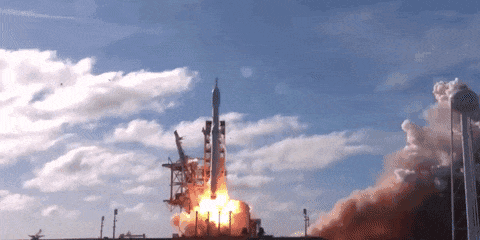

# Summary

**Company**: [Novavax](http://www.novavax.com/)

**Ticker**: NASDAQ:NVAX

**Price**: $1.67 (14/09/2018) / **52w Low**: $1.05 / **52w High**: $2.75

**Market Cap**: $643M (14/09/2018)

**Institutional Ownership**: % (Q3 2018)

**Cash**: $M (Q3 2018)

**Debt**: $M (Q3 2018) / **Current Liabilities**: $M (3Q 2018)

**Burn**: $M (2018)

## Catalyst

Q1 2019

OR

