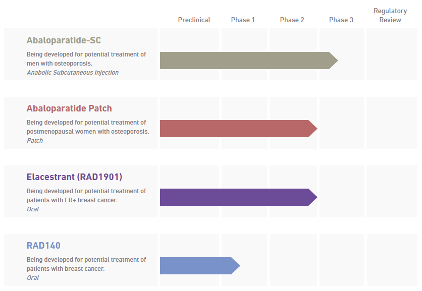

# Summary

**Company**: [Radius](https://radiuspharm.com/)

**Ticker**: NASDAQ:RDUS

**Price**: $14.69 (14/09/2018) / **52w Low**: $15.67 / **52w High**: $41.16

**Market Cap**: $668M (14/09/2018)

**Institutional Ownership**: 116.74% (Q3 2018) / 4 generalist funds sold 4M in Q2 2018

**Insider**: BB Biotech AG 6.5M-$103M (14.5%) / 850K-$13M

**Cash**: $235M (End 2018)

**Debt**: $224M (Q3 2018) / **Current Liabilities**: $48M (Q3 2018) / **Notes Payable**: $177M

**Burn**: $320M (2018) / **Revenues**: $27M (Q3 2018) / 65M (9 months 2018) / > 98M (2018)

**Guidance Cash**: >$220M (2018) / >$100M (2019)

**Guidance Revenues**: $95M-$98M (2018) / $155M-$175M (2019)

## Catalyst

* Abaloparatide:
    * Ex-US parnertship (each country) end 2018

* Abaloparatide Patch:
    * Begin Phase mid 2019

* Elacestrant:
    * Initiate Phase 3 in breast cancer to target a broader patient population, comprised of 2nd and 3rd line ER+ mBC Q4 2018. Recruitment period of 18-21 months and potential data read-out in 2021. **Elacestrant’s Phase 3 EMERALD study was initiated in December 2018.**

* RAD140:
    * Continue enrollment in the Phase 1 study and provide a program update by the end of 2018

Competition:

* Forteo generic entrants in the 2H 2019 (teriparatide). RDUS: Abaloparatide highly differentiated, we believe that the impact on us is not significant. At this point we have multi-year contracts (more than 95% of our contracts go into through 2020) and feel confident that where we've come in from a price point that we're well-positioned even with that generic competition entrants

## Pipeline

[Pipeline](https://radiuspharm.com/pipeline/):

### Abaloparatide-SC

In 2018 we initiated a phase 3 study of abaloparatide injection for the treatment of osteoporosis in men. The randomized, double-blind, placebo-controlled trial will enroll approximately 225 men with osteoporosis. If successful, this study will serve as the basis of a supplemental New Drug Application (sNDA) seeking to expand the use of abaloparatide to treat men with osteoporosis at high risk for fracture.

Clinical Trials:

* [Safety and Efficacy of Abaloparatide-SC in Men With Osteoporosis (ATOM)](https://clinicaltrials.gov/ct2/show/NCT03512262)

### Abaloparatide Patch

We are developing abaloparatide-patch for potential use as a short wear-time patch for the treatment of postmenopausal women with osteoporosis. In 2018, Radius met with the FDA to align on a regulatory development path for the abaloparatide patch. We expect to initiate the pivotal trial in mid-2019.

### Elacestrant (RAD1901)

Elacestrant is a selective estrogen receptor degrader (SERD) which is being evaluated for potential use as a once daily oral treatment for hormone-receptor positive breast cancer. Elacestrant is currently being investigated in postmenopausal women with advanced estrogen receptor positive (ER+) and human epidermal growth factor receptor 2-negative (HER2-) breast cancer, the most common form of the disease. Studies completed to date indicate that the compound has the potential for use as a single agent or in combination with other therapies for the treatment of breast cancer.

Clinical Trials:

* [A Phase IB Study to Evaluate the Effect of RAD1901 on the Availability of Estrogen Receptor Binding Sites in Metastatic Breast Cancer](https://www.clinicaltrials.gov/ct2/show/NCT02650817)

* [A Phase I, Multicenter, Open-Label, Multi-Part, Dose-escalation Study of RAD1901 in Postmenopausal Women With Advanced Estrogen Receptor Positive and HER2-Negative Breast Cancer](https://www.clinicaltrials.gov/ct2/show/NCT02338349)

### RAD140

RAD140 is an internally discovered nonsteroidal selective androgen receptor modulator (SARM). The androgen receptor, or AR, is highly expressed in hormone-receptor positive breast cancers. In 2017, we initiated a Phase 1 study of RAD140 in postmenopausal women with hormone-receptor positive, locally advanced or metastatic breast cancer.

Clinical Trial

* [A Phase 1, First-in-Human, Multi-Part Study of RAD140 in Postmenopausal Women With Hormone Receptor Positive Breast Cancer](https://www.clinicaltrials.gov/ct2/show/NCT03088527)

## Company

Radius Health, Inc. (“Radius” or the “Company”) is a science-driven fully integrated biopharmaceutical company that is committed to developing and
commercializing innovative endocrine therapeutics in the areas of osteoporosis and oncology. In April 2017, the Company's first commercial product,
TYMLOS® (abaloparatide) injection, was approved by the U.S. Food and Drug Administration (“FDA”) for the treatment of postmenopausal women with
osteoporosis at high risk for fracture defined as history of osteoporotic fracture, multiple risk factors for fracture, or patients who have failed or are intolerant
to other available osteoporosis therapy. In April 2018, the Company submitted a request for re-examination of the negative opinion adopted by the
Committee for Medicinal Products for Human Use (“CHMP”) of the European Medicines Agency (“EMA”) on the Company’s European Marketing
Authorisation Application (“MAA”) for abaloparatide for subcutaneous administration (“abaloparatide-SC”) and in July 2018, following a re-examination
procedure, the CHMP maintained its negative opinion. The Company's clinical pipeline includes an investigational abaloparatide transdermal patch
(“abaloparatide-patch”) for potential use in the treatment of postmenopausal women with osteoporosis; the investigational drug elacestrant (RAD1901), a
selective estrogen receptor degrader for potential use in the treatment of hormone-receptor positive breast cancer; and the investigational drug RAD140, a
non-steroidal, selective androgen receptor modulator for potential use in the treatment of hormone-receptor positive breast cancer.

## Convertible notes

On August 14, 2017, in a registered underwritten public offering, the Company issued $300 million aggregate principal amount of 3% Convertible Senior
Notes due September 1, 2024.

The Convertible Notes are senior unsecured obligations of the Company and bear interest at a rate of 3.00% per annum, payable semi-annually in arrears on March 1 and September 1, beginning on March 1, 2018. Upon conversion, the Convertible Notes will be convertible into cash, shares of the Company’s common stock or a combination of cash and shares of the Company’s common stock, at the Company’s election. The Convertible Notes will mature on September 1, 2024, unless earlier converted, redeemed or repurchased in accordance with their terms. The notes are equivalent to an initial conversion price of approximately $48.81 per share of common stock.

## Studies

### Abaloparatide

In April 2017, the FDA approved TYMLOS for the treatment of postmenopausal women with osteoporosis at high risk for fracture defined as history of osteoporotic fracture, multiple risk factors for fracture, or patients who have failed or are intolerant to other available osteoporosis therapy. We are developing two formulations of abaloparatide: abaloparatide-SC and abaloparatide-patch.

#### Abaloparatide-SC

TYMLOS was approved in the United States in April 2017 for the treatment of postmenopausal women with osteoporosis at high risk for fracture. The first commercial sales of TYMLOS in the United States occurred in May 2017 and as of October 16, 2018, TYMLOS was available and covered for approximately 265 million U.S. insured lives, representing approximately 95% of U.S. commercial and 44% of Medicare insured lives. Effective January 1, 2019, we project TYMLOS will be available and covered for approximately 274 million U.S. insured lives, representing approximately 95% of U.S. commercial and 64% of Medicare insured lives. We are commercializing TYMLOS in the United States through our commercial organization. We have built a distribution network for TYMLOS in the United States, comprised of well-established distributors and specialty pharmacies. Under our distribution model, both the distributors and specialty pharmacies take physical delivery of TYMLOS and the specialty pharmacies dispense TYMLOS directly to patients. We hold worldwide commercialization rights to abaloparatide-SC, except for Japan, where we have an option to negotiate a co-promotion agreement with Teijin for abaloparatide-SC. We intend to enter a collaboration for the commercialization of abaloparatide-SC outside of the United States and Japan. In March 2018, the CHMP of the EMA adopted a negative opinion on our European MAA for abaloparatide-SC. In April 2018, we submitted a request for reexamination of the CHMP’s opinion and in July 2018, following a re-examination procedure, the CHMP maintained its negative opinion.

In May 2017, we announced positive top-line results from the completed 24-month ACTIVExtend clinical trial of TYMLOS, which met all of its primary and secondary endpoints. In ACTIVExtend, patients who had completed 18 months of TYMLOS (abaloparatide) injections or placebo in the ACTIVE Phase 3 trial were transitioned to receive 24 additional months of open-label alendronate. For the subset of ACTIVE trial patients (n=1139) that enrolled in the ACTIVExtend trial, the previous TYMLOS-treated patients had a significant 84% relative risk reduction (p<0.0001) in the incidence of new vertebral fractures compared with patients who received placebo followed by alendronate. They also demonstrated a 39% risk reduction in nonvertebral fractures (p=0.038), a 34% risk reduction clinical fractures (p=0.045) and a 50% risk reduction in major osteoporotic fractures (p=0.011) compared with patients who received placebo followed by alendronate. At the 43-month timepoint, for all patients (n=1645) that enrolled in the ACTIVE trial, TYMLOS-treated patients had a statistically significant risk reduction in new vertebral fractures (p<0.0001), nonvertebral fractures (p=0.038), clinical fractures (p=0.045), and major osteoporotic fractures (p<0.001), compared with patients who received placebo followed by alendronate. While not a pre-specified endpoint, there was also a statistically significant risk reduction in hip fractures (p=0.027) at the 43-month time point in the TYMLOS-treated patients, compared with patients who received placebo followed by alendronate. The adverse events reported during the alendronate treatment period were similar between the previous TYMLOStreated patients and the previous placebo group. The incidences of cardiovascular adverse events including serious adverse events were similar between groups. There have been no cases of osteonecrosis of the jaw or atypical femoral fracture in the entire TYMLOS development program. The results from the completed ACTIVExtend trial were presented at a major scientific meeting in September 2017 and we submitted a labeling supplement in connection with this data to the FDA in December 2017. In October 2018, the FDA approved a labelling supplement for TYMLOS to reflect that after 24 months of open-label alendronate therapy, the vertebral fracture risk reduction achieved with TYMLOS therapy was maintained.

In July 2017, we entered into a license and development agreement with Teijin for abaloparatide-SC in Japan. Pursuant to the agreement, we received an upfront payment and may receive additional milestone payments upon the achievement of certain regulatory and sales milestones, and a fixed low doubledigit royalty based on net sales of abaloparatide-SC in Japan during the royalty term. In addition, we have an option to negotiate for a co-promotion agreement with Teijin for abaloparatide-SC in Japan.

In March 2018, we initiated a clinical trial in men with osteoporosis which, if successful, will form the basis of a supplemental NDA seeking to expand the use of TYMLOS to treat men with osteoporosis at high risk for fracture. The study will be a randomized, double-blind, placebo-controlled trial that will enroll approximately 225 men with osteoporosis. The primary endpoint is change in lumbar spine BMD at 12 months compared with placebo. In previous clinical trials, TYMLOS has demonstrated increases in BMD in postmenopausal women. The study includes specialized high-resolution imaging to examine the effect of abaloparatide on bone structure, such as the hip, in a subset of the study participants. In June 2018, the FDA approved a labeling supplement for TYMLOS to revise the needle length in the Instructions for Use from 8 mm to 5 mm. We believe health care providers, specialty pharmacies, and patients may prefer a shorter needle size for injectable products like TYMLOS. In July 2018, we initiated a bone histomorphometry study, which will enroll approximately 25 postmenopausal women with osteoporosis to evaluate the early effects of TYMLOS on tissue-based bone remodeling and structural indices.

#### Abaloparatide-patch

We are also developing abaloparatide-patch, based on 3M’s patented Microstructured Transdermal System technology, for potential use as a short wear-time transdermal patch. We hold worldwide commercialization rights to the abaloparatide-patch technology and we are developing abaloparatide-patch toward future global regulatory submissions to build upon the potential success of TYMLOS. Our development strategy for abaloparatide patch is to bridge to the established efficacy and safety of our approved abaloparatide-SC formulation.

We commenced a human replicative clinical evaluation of the optimized abaloparatide-patch in December 2015, with the goal of achieving comparability to abaloparatide-SC. In September 2016, we presented results from this evaluation of the first and second abaloparatide-patch prototypes, demonstrating that formulation technology can modify the pharmacokinetic profile of abaloparatide, including Tmax, half-life (“T1/2”), and area under the curve (“AUC”). In March 2018, we announced that through further optimization we had achieved comparability to the abaloparatide-SC profile with a third prototype (the “current abaloparatide-patch”). The current abaloparatide-patch optimized the drug-device combination through process improvements, a finalized formulation, selection of a dose (300 µg), and the introduction of a new clinical applicator. Together these changes, which were designed to improve the ease of use and patient experience, resulted in an increased half-life and AUC (915 pg.hr/ml for the current abaloparatide-patch, compared to 242 pg.hr/ml for the first patch prototype, 645 pg.hr/ml for the second patch prototype, and 936 pg.hr/ml for abaloparatide-SC).

In January 2018, we met with the FDA to align on a regulatory and development path for registration of abaloparatide-patch. We gained alignment with the agency on a single, pivotal BMD non-inferiority bridging study to support an NDA submission. The FDA agreed that, depending on the study results, a randomized, open label, active-controlled, non-inferiority Phase 3 study of up to 500 patients with postmenopausal osteoporosis at high risk of fracture would be sufficient to gain approval for abaloparatide-patch. The FDA confirmed that the primary endpoint will be change in lumbar spine BMD at 12 months and that the non-inferiority margin must preserve 75% of the active control (abaloparatide-SC) based on the lower bound of the 95% confidence interval. We expect to initiate this pivotal study in mid-2019 and to complete it in 2020. In February 2018, we entered into a scale-up and commercial supply agreement with 3M Company pursuant to which 3M has agreed to exclusively manufacture Phase 3 and global commercial supplies of abaloparatide-patch. In October 2018, we committed to fund 3M's purchase of capital equipment totaling approximately $9.6 million in preparation for manufacturing Phase 3 and potential commercial supplies of abaloparatide-patch. Milestone payments for the equipment are expected to be made between the fourth quarter of 2018 and the third quarter of 2020.

### Elacestrant (RAD1901)

Elacestrant is a SERD that we are evaluating for potential use as a once daily oral treatment for hormone-receptor positive breast cancer. We hold worldwide commercialization rights to elacestrant. Elacestrant is currently being investigated in women with advanced ER-positive and HER2-negative breast cancer, the most common subtype of the disease. Studies completed to date indicate that the compound has the potential for use as a single agent or in combination with other therapies for the treatment of breast cancer. We have completed enrollment in our FES-PET imaging study and dose-escalation Part A and expansion study parts B and C Phase 1 breast cancer trials. These studies have identified a single oral dose of 400 mg per day for evaluation in subsequent monotherapy trials.

In October 2017, the FDA granted Fast Track designation for our elacestrant breast cancer program.

In February 2018, we received scientific advice from the EMA regarding a potential single-arm monotherapy Phase 2 trial of elacestrant in patients with ER+, HER2- advanced or metastatic breast cancer. In addition, we had a meeting in February 2018 with the FDA regarding the registrational pathway for elacestrant at which we confirmed FDA’s guidance for a single-arm study and gained alignment with the agency on an alternative potential comparator study design for our monotherapy program. Following further review and additional input from the FDA, we currently intend to conduct a single, randomized, open label, active-controlled Phase 3 trial of elacestrant as a second- or third-line monotherapy in approximately 460 patients with ER+/HER2- advanced/metastatic breast cancer who have received prior treatment with one or two endocrine therapies, including a cyclin-dependent kinase (“CDK”) 4/6 inhibitor. Patients in the study would be randomized to receive either elacestrant or the investigator’s choice of an approved hormonal agent. The primary endpoint of the study will be PFS, which we will analyze in the overall patient population and in patients with ESR1 mutations. Secondary endpoints will include evaluation of OS, ORR, and DOR. We believe that, depending on results, this single trial would support applications for marketing approvals for elacestrant as a second- and third-line monotherapy in the U.S., EU and other markets. We expect to initiate the Phase 3 study in the fourth quarter of 2018 with a planned recruitment period of 18 to 21 months. In September 2018, we submitted a request to the FDA for an additional Fast Track designation for elacestrant consistent with the population to be included in the Phase 3 study.

**Phase 1 - Dose-Escalation and Expansion Study**
In December 2014, we commenced a Phase 1, multicenter, open-label, multiple-part, dose-escalation study of elacestrant in postmenopausal women with ERpositive and HER2-negative advanced breast cancer in the United States to determine the recommended dose for a Phase 2 clinical trial and to make a preliminary evaluation of the potential anti-tumor effect of elacestrant. Part A of this Phase 1 study was designed to evaluate escalating doses of elacestrant. The Part B expansion cohort was initiated at 400-mg daily dosing in March 2016 to allow for an evaluation of additional safety, tolerability and preliminary efficacy. The patients enrolled in this study are heavily pretreated ER-positive, HER2-negative advanced breast cancer patients who have received a median of 3 prior lines of therapy including fulvestrant and CDK4/6 inhibitors, and about 50% of the patients had ESR1 mutations. We have completed enrollment in the ongoing dose-escalation Part A and expansion study parts B and C. In December 2017, we opened a Part D cohort in this study to provide additional data on a more homogeneous patient population to support our overall elacestrant clinical development program and anticipated regulatory submissions. We discontinued recruitment in the Part D cohort because the outcome is no longer relevant to the revised study population for our Phase 3 study.

In December 2016 and June 2017, we reported positive results from this ongoing Phase 1 dose-escalation and expansion study. As of the study cut-off date of April 28, 2017, the elacestrant single agent ORR was 23% with five confirmed partial responses in heavily pre-treated patients with advanced ER-positive breast cancer and in the 400-mg patient group of 26 patients with mature data, the median PFS was 4.5 months. These results showed that elacestrant was well-tolerated with the most commonly reported adverse events being low grade nausea and dyspepsia.

In December 2017, we reported updated data from this ongoing Phase 1 dose-escalation and expansion study, which included mature data from 40 patients treated at the 400 mg dose in this study. As of the study cut-off date of October 30, 2017, the elacestrant single agent ORR was 27.3% with six confirmed partial responses out of 22 patients with response evaluation criteria in solid tumors (“RECIST”) measurable disease. The median PFS was 5.4 months and clinical benefit rate at 24 weeks was 47.4%. These results showed that elacestrant was well-tolerated with the most commonly reported adverse events being low grade nausea, dyspepsia and vomiting. Ten patients were enrolled in the Part D cohort, and as of June 30, 2018, three patients remained on treatment.

**Phase 1 - FES-PET Study**
In December 2015, we commenced a FES-PET study in patients with metastatic breast cancer in the EU, which includes the use of FES-PET imaging to assess estrogen receptor occupancy in tumor lesions following elacestrant treatment.

In December 2016, we reported positive results from the Phase 1 FES-PET study. The first three enrolled patients dosed at the 400-mg cohort had a tumor FES-PET signal intensity reduction ranging from 79% to 91% at day 14 compared to baseline. This study enrolled five additional patients in the 400-mg daily oral cohort, followed by eight patients in the 200-mg daily oral cohort.

In December 2017, we reported updated data from the Phase 1 FES-PET study showing that elacestrant demonstrated robust reduction in tumor ER availability in patients with advanced ER+ breast cancer who progressed on prior endocrine therapy. Seven out of eight patients dosed at the 400-mg cohort, and four out of seven patients dosed at the 200-mg cohort, had a tumor FES-PET signal intensity reduction equal to, or greater than, 75% at day 14 compared to baseline. The reduction in FES uptake supports flexibility for both 200-mg and 400- mg elacestrant dose selection for further clinical development in combination studies with various targeted agents and was similar in patients harboring mutant or wild-type ESR1. The most commonly reported adverse events reported were grade 1 and 2 nausea and dyspepsia.

**Potential for use in Combination Therapy**
In July 2015, we announced that early but promising preclinical data showed that our investigational drug elacestrant, in combination with Pfizer’s palbociclib, a cyclin-dependent kinase, or CDK 4/6 inhibitor, or Novartis’ everolimus, an mTOR inhibitor, was effective in shrinking tumors. In preclinical patient-derived xenograft breast cancer models with either wild type or mutant ESR1, treatment with elacestrant resulted in marked tumor growth inhibition, and the combination of elacestrant with either agent, palbociclib or everolimus, showed anti-tumor activity that was significantly greater than either agent alone. We believe that this preclinical data suggests that elacestrant has the potential to overcome endocrine resistance, is well-tolerated, and has a profile that is well suited for use in combination therapy.

In December 2017, we announced additional preclinical data that continues to demonstrate elacestrant anti-tumor activity, as a single agent and in combination, in multiple models. In these preclinical models, elacestrant demonstrated marked tumor growth inhibition, as a single agent in models treated with multiple rounds of fulvestrant and in combination with CDK 4/6 inhibitors such as palbociclib and abemaciclib and with a phosphoinositide 3-kinase inhibitor, alpelisib.

#### Collaborations

In July 2016, we entered into a pre-clinical collaboration with Takeda Pharmaceutical Company Limited to evaluate the combination of elacestrant with Takeda's investigational drug TAK-228, an oral mTORC 1/2 inhibitor in Phase 2b development for the treatment of breast, endometrial and renal cancer, with the goal of potentially exploring such combination in a clinical study. We and Takeda have each agreed to contribute resources and supply compound material necessary for studies to be conducted under the collaboration and will share third party out-of-pocket research and development expenses. Activities under this collaboration are ongoing. Upon completion, both parties will agree upon the appropriate communication of the results.

In January 2016, we entered into a worldwide clinical collaboration with Novartis Pharmaceuticals to evaluate the safety and efficacy of combining elacestrant with Novartis’ investigational agent LEE011 (ribociclib), a CDK 4/6 inhibitor, and BYL719 (alpelisib), an investigational phosphoinositide 3- kinase inhibitor.

In January 2018, we terminated this collaboration following the completion of preclinical studies. We are evaluating additional opportunities to collaborate with companies to evaluate the safety and efficacy of combining elacestrant with other targeted agents for the treatment of breast cancer. We believe that such combinations may be suitable in earlier lines of treatment for patients with advanced disease.

### RAD140

RAD140 is an internally discovered SARM. The androgen receptor, or AR, is highly expressed in many ER-positive, ER-negative, and triple-negative receptor breast cancers. Due to its receptor and tissue selectivity, potent activity, oral bioavailability, and long half-life, we believe RAD140 could have clinical potential in the treatment of breast cancer. We hold worldwide commercialization rights to RAD140.

In July 2016, we reported that RAD140 in preclinical xenograft models of breast cancer demonstrated potent tumor growth inhibition when administered alone or in combinations with CDK4/6 inhibitors. It is estimated that 77% of breast cancers show expression of the androgen receptor. Our data suggest that RAD140 activity at the androgen receptor leads to activation of AR signaling pathways including an AR-specific tumor suppressor and suppression of ER signaling.

In April 2017, we presented these RAD140 preclinical results at a major scientific congress.

In September 2017, we initiated a Phase 1 study of RAD140 in patients with locally advanced or metastatic breast cancer. The clinical trial is designed to evaluate the safety and maximum tolerated dose of RAD140 in approximately 40 patients. Primary safety outcomes from the trial include rate of doselimiting toxicities, adverse events related to treatment, and tolerability as measured by dose interruptions or adjustments. In addition, pharmacokinetics, pharmacodynamics and tumor response will also be evaluated. We expect to provide an update on our RAD140 development program by the end of 2018