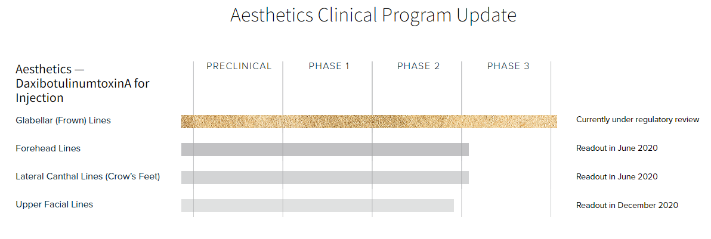
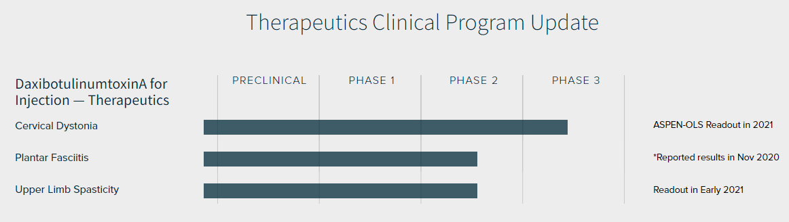

# Summary

**Company**: [Revance](http://www.revance.com/)

**Ticker**: NASDAQ:RVNC

**Price**: $24.51 (28/11/2018) / **52w Low**: $11.78 / **52w High**: $34.62

**Market Cap**: $1.6B (28/11/2018)

**Institutional Ownership**: 80.56% (Q3 2020)

**Cash**: $435.8M (Q3 2020)

**Debt**: $339M (Q3 2020) / **Current Liabilities**: $64M (Q3 2020)

**Burn**: $81M (Q3 2020) / 204M (9m 2020)

**ATM**: 125M

## Catalyst

* DaxibotulinumtoxinA for Injection:
    * Aesthetics:
        * PDUFA in the treatment of moderate to severe glabellar (frown) lines. **Q1 2021?** Pending facilities inspection.
        * Topline results from Phase 2 open-label, dose-escalation study of DaxibotulinumtoxinA for Injection in upper facial lines expected in **December 2020**.
    * Therapeutics:
        * Topline results from JUNIPER Phase 2 placebo-controlled, dose-ranging study of DaxibotulinumtoxinA for Injection in upper limb spasticity. **Q1 2021**.
        * Topline results from the companion ASPEN-OLS Phase 3 open-label, long-term safety trial, expected in **2021**.

## Pipeline

[Pipeline Aesthetics](https://www.revance.com/aesthetics/neuromodulator/):

[Pipeline Therapeutics](https://www.revance.com/therapeutics/):

## Latest Presentation

[Company Overview November 2020](https://investors.revance.com/static-files/adc301b5-8437-4730-82ad-4913a3c699ea)

## Business Overview

Revance Therapeutics, Inc. is a biotechnology company focused on innovative aesthetic and therapeutic offerings, including its next-generation neuromodulator product, DaxibotulinumtoxinA for Injection. DaxibotulinumtoxinA for Injection combines a proprietary stabilizing peptide excipient with a highly purified botulinum toxin that does not contain human or animal-based components.

We have successfully completed a Phase 3 program for DaxibotulinumtoxinA for Injection in glabellar (frown) lines and are pursuing U.S. regulatory approval in 2020. We are also evaluating DaxibotulinumtoxinA for Injection in the full upper face, including glabellar lines, forehead lines and crow’s feet, as well as in three therapeutic indications: cervical dystonia, adult upper limb spasticity and plantar fasciitis. To accompany DaxibotulinumtoxinA for Injection, we own a unique portfolio of premium products and services for U.S. aesthetics practices, including the exclusive U.S. distribution rights to the RHA® Collection of dermal fillers, the first and only range of FDA-approved fillers for correction of dynamic facial wrinkles and folds, and the HintMD fintech platform, which includes integrated smart payment, subscription and loyalty digital services.

We have also partnered with Mylan N.V. to develop a biosimilar to BOTOX®, which would compete in the existing short-acting neuromodulator marketplace. We are dedicated to making a difference by transforming patient experiences.

## Convertible Senior Notes

On February 14, 2020, we issued $287.5 million aggregate principle amount of convertible senior notes that are due in 2027. The 2027 Notes are senior unsecured obligations and bear interest at a rate of 1.75% per year, payable semiannually in arrears on February 15 and August 15 of each year, beginning on August 15, 2020. The 2027 Notes will mature on February 15, 2027, unless earlier converted, redeemed or repurchased.

## Partners

In December 2018, we entered into a license agreement (the “Fosun License Agreement”) with Shanghai Fosun Pharmaceutical Industrial Development Co., Ltd., a wholly-owned subsidiary of Shanghai Fosun Pharmaceutical (Group) Co., Ltd (“Fosun”), whereby we granted Fosun the exclusive rights to develop and commercialize our proprietary DaxibotulinumtoxinA for Injection in mainland China, Hong Kong and Macau (the “Fosun Territory”) and certain sublicense rights.

Fosun has paid us non-refundable upfront and other payments totaling $31.0 million before foreign withholding taxes. We are also eligible to receive (i) additional remaining contingent payments of up to $229.5 million upon the achievement of certain milestones based on (a) the approval of biologics license applications (“BLAs”) for certain aesthetic and therapeutic indications and (b) first calendar year net sales, and (ii) tiered royalty payments in low double digit to high teen percentages on annual net sales.

## Info

On July 23, 2020, we completed the acquisition of Hint, Inc. (d/b/a HintMD) by acquiring 100% of the HintMD stock that was issued and outstanding as of the date of acquisition for a total purchase consideration of $189.6 million (see Note 3). Through the HintMD platform, we provide a cloud-based patient engagement and payments platform to medical aesthetic practitioners. The HintMD platform provides patients with the ability to receive personalized aesthetic treatment plans and pay for them using monthly subscription payments, which improves consistency of treatments and affordability. The condensed consolidated financial statements as of and for the period ended September 30, 2020 include the financial results of HintMD from the acquisition completion date.

### Service Revenue

Following the HintMD Acquisition in July 2020 (Note 3), we began to offer customer payment processing and subscription services through our HintMD fintech platform to aesthetic practices. Revenue related to the payment processing service is recognized at a point in time, whereas revenue related to the subscription service is recognized over time.

## Pipeline

### DaxibotulinumtoxinA for Injection

#### Aesthetics

* **Glabellar lines**. In December 2018, we announced topline results for the SAKURA 3 open-label, long-term safety study. DaxibotulinumtoxinA for Injection appeared to be generally well-tolerated with no new tolerability or safety concerns reported. We submitted the BLA in November 2019. The FDA accepted the BLA on February 5, 2020, and the Prescription Drug User Fee Act (“PDUFA”) target action date is November 25, 2020. If the BLA is approved on or by the target action date, we plan to initiate commercialization activities for DaxibotulinumtoxinA for Injection for the treatment of glabellar lines before the end of 2020. However, the FDA has not scheduled a manufacturing site inspection related to the company’s BLA for DaxibotulinumtoxinA for Injection in the treatment of moderate to severe glabellar (frown) lines. The FDA has indicated that an inspection of the Newark, California manufacturing site will be required prior to the BLA approval. We continue to work proactively with the FDA to secure an inspection at the earliest possible time. Currently, however, the FDA is still subject to restrictions on travel related to the COVID-19 pandemic, therefor there may be delays.

* **Forehead lines**. In January 2019, we initiated a Phase 2 multicenter, open-label, dose-escalation study to evaluate treatment of moderate or severe dynamic forehead lines in conjunction with treatment of the glabellar complex. The objective is to understand the potential dosing and injection patterns of DaxibotulinumtoxinA for Injection in other areas of the upper face in addition to the lead indication in glabellar lines. We completed enrollment for the study in July 2019 and released topline results in June 2020. The primary endpoint for efficacy was the proportion of subjects achieving a score of none or mild in wrinkle or line severity at Week 4 at maximum eyebrow elevation for forehead lines In this study, 100% of subjects achieved a score of none or mild at Week 4 in at least one treatment group. DaxibotulinumtoxinA for Injection was well-tolerated at all dose levels. Adverse events were mild, localized and transient as expected and there were no treatment-related serious adverse events, as is common with other approved neuromodulators in the treatment of upper facial lines. One of the exploratory endpoints in the study was duration of effect, defined as the median time to return to baseline wrinkle severity based on both investigator and patient assessment. At least one dose in the study demonstrated a median duration of effect of 27 weeks on forehead lines.

* **Lateral canthal lines**. In March 2019, we initiated a Phase 2 multicenter, open-label, dose-escalation study to evaluate the treatment of moderate or severe lateral canthal lines. The objective is to understand the potential dosing of DaxibotulinumtoxinA for Injection in the lateral canthal area. We released topline results in June 2020. The primary endpoint for efficacy was the proportion of subjects achieving a score of none or mild in wrinkle or line severity at Week 4 at maximum smile for crow’s feet. In this study, 88% of subjects achieved a score of none or mild at Week 4 in at least one treatment group. DaxibotulinumtoxinA for Injection was well-tolerated at all dose levels. Adverse events were mild, localized and transient as expected and there were no treatment-related serious adverse events, as is common with other approved neuromodulators in the treatment of upper facial lines. One of the exploratory endpoints in the study was duration of effect, defined as the median time to return to baseline wrinkle severity based on both investigator and patient assessment. At least one dose in the study demonstrated a median duration of effect of 24 weeks on crow’s feet.

* **Upper Facial Lines**. In December 2019, we initiated a new multicenter, open-label Phase 2 trial for treatment of the upper facial lines -- glabellar (frown), lateral canthal (crow’s feet), and forehead lines combined -- to understand the safety and efficacy, including potential dosing and injection patterns, of DaxibotulinumtoxinA for Injection, covering the upper facial lines. This trial is in addition to the open-label Phase 2 clinical trials that we completed and reported in June 2020. Interim Week 4 data from the Phase 2a studies in forehead lines and crow’s feet were used in the final design of this current upper facial lines Phase 2 study to optimize dosing and injection patterns. We completed enrollment in the first quarter of 2020 with all subjects dosed and **expect to release topline results in the December of 2020**.

#### Therapeutics

* **Cervical dystonia (ASPEN)**. The ASPEN Phase 3 clinical program consists of two trials to evaluate the safety and efficacy of DaxibotulinumtoxinA for Injection for the treatment of cervical dystonia in adults including a randomized, double-blind, placebo-controlled, parallel group trial (ASPEN-1), and an open-label, long-term safety trial (ASPEN-OLS).

    In October 2020, we announced the positive topline results from the ASPEN-1 trial. This pivotal study enrolled a total of 301 subjects at 60 sites in the U.S., Canada and Europe. Subjects were randomized 3:3:1 to receive a single treatment of either 125 Units or 250 Units of DaxibotulinumtoxinA for Injection, or placebo and were followed for up to 36 weeks. The drug appeared to be generally safe and well-tolerated at both doses. The study met its primary efficacy endpoint at both doses, demonstrating a clinically meaningful improvement in the signs and symptoms of cervical dystonia at the average of Weeks 4 and 6. Compared to placebo, subjects treated with either 125 Units or 250 Units showed a statistically significant greater change from baseline as measured on the Toronto Western Spasmodic Torticollis Rating Scale (TWSTRS) Total Score. Median duration of effect was 24.0 and 20.3 weeks, for the 125 Unit and 250 Unit dose groups respectively, based on the median time to loss of 80% of the peak treatment effect. There were no serious treatment-related adverse events and no dose-dependent increase in adverse events was observed. Treatment-related adverse events were generally transient and mild to moderate in severity, with one case of neck pain reported as severe, which resolved two days after onset. The three most common treatment-related adverse events were (for 125 Units and 250 Units, respectively): injection site pain (7.9%, 4.7%), headache (4.7%, 4.7%), and injection site erythema (4.7%, 2.3%). The incidence of dysphagia (difficulty swallowing) and muscle weakness, which are considered adverse events of particular interest with botulinum toxin treatments for cervical dystonia, was low (for 125 Units and 250 Units, respectively): dysphagia (1.6%, 3.9%) and muscular weakness (4.7%, 2.3%).

    We completed the enrollment for ASPEN-OLS with a total of 354 subjects and **expect to release topline results in 2021**. DaxibotulinumtoxinA for Injection for cervical dystonia is expected to be our first therapeutic indication of which we are **aiming for regulatory approval in 2023**.

* **Adult upper limb spasticity (JUNIPER)**. In December 2018, we initiated a Phase 2 trial for the treatment of adult upper limb spasticity (JUNIPER). This is a randomized, double-blind, placebo-controlled, parallel group, dose-ranging trial to evaluate the efficacy and safety of DaxibotulinumtoxinA for Injection for the treatment of upper limb spasticity in adults after stroke or traumatic brain injury. Enrollment in the JUNIPER Phase 2 adult upper limb spasticity trial was paused in March 2020 due to challenges in subject assessments during the time of required social distancing related to the COVID-19 pandemic. In June 2020, we announced the decision to end screening and complete enrollment in the study in the JUNIPER Phase 2 adult upper limb spasticity trial. We plan to complete the Phase 2 study in the first quarter of 2021 with 83 subjects enrolled. We believe that truncating the Phase 2 trial enrollment in June could potentially allow them to move into the pivotal Phase 3 upper limb spasticity trials earlier than originally planned, while also avoiding patient enrollment during this challenging time. **We expect to announce topline data from the JUNIPER Phase 2 trial in first quarter of 2021**.

* **Plantar fasciitis**. In December 2018, we initiated a Phase 2 prospective, randomized, double-blind, multi-center, placebo-controlled study to evaluate the safety and efficacy of two doses of DaxibotulinumtoxinA for Injection in reducing the signs and symptoms of plantar fasciitis, a painful affliction caused by inflammation of the ligament running along the bottom of the foot (the plantar fascia). We released topline results in November 2020. The study’s primary efficacy endpoint was the change from baseline on the 10-point Numeric Pain Rating Scale (NPRS) score averaged over five days at Week 8. In the trial, both doses of DaxibotulinumtoxinA for Injection resulted in significant measurable pain relief after treatment that was numerically greater than placebo. However, **neither dose met the primary efficacy endpoint of statistically significant improvement from baseline in the NPRS for foot pain at Week 8, compared to placebo**. Subjects treated with DaxibotulinumtoxinA for Injection showed an average reduction from baseline of 3.29 on the NPRS (a 54.6% reduction) at 80U (p=0.2135 vs. placebo) and 3.25 on the NPRS (a 50.1% reduction) at 120U (p=0.2205 vs. placebo, p=0.9207 vs. 80U), compared to placebo subjects at 2.75 on the NPRS (a 45.1% reduction). DaxibotulinumtoxinA for Injection was found to be safe and well-tolerated at both doses through Week 24. There were no serious treatment-related adverse events and no dose dependent increase in adverse events was observed. Treatment-related adverse events were generally transient and mild to moderate in severity.

* **Migraine**. As part of our 2020 planning process, we decided to adjust the initiation of migraine clinical trials this year and will re-evaluate the timing next year as part of our 2021 planning cycle.

