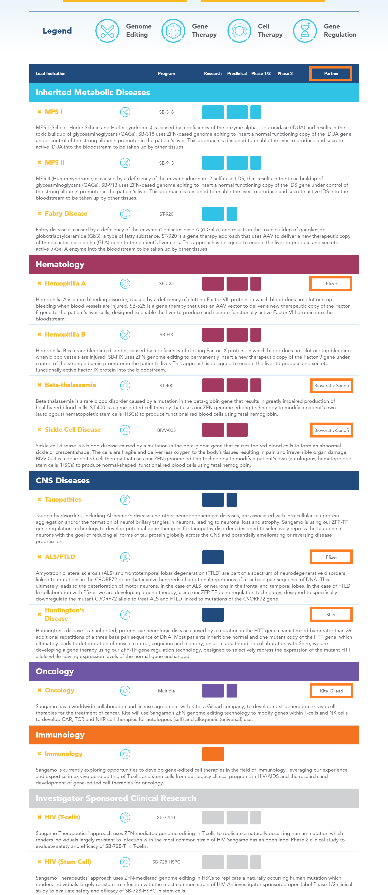

# Summary

**Company**: [Sangamo Therapeutics](https://www.sangamo.com)

**Ticker**: NASDAQ:SGMO

**Price**: $9.5 (14/09/2018) / **52w Low**: $27.5 / **52w High**: $9

**Market Cap**: $971M (14/09/2018)

**Institutional Ownership**: 66% (Q3 2018)

**Cash**: $460M (Q3 2018)

**Debt**: $327M (Q3 2018) / **Current Liabilities**: $74M (Q3 2018) / **Deferred Revenues**: $170M

**Burn**: $115M (9 months 2018) / $40 (Q3 2018)

**Cash Level**: $5 (14/09/2018)

**Revenues for Milestones**: $57M (9 months 2018)

**Received/Pending Revenues for Milestones**: ~$300M/$4B (Q3 2018)

## Catalyst (by Biotech2k)

* SB-525 Hemophilia A
    * Phase 1 update at ASH in December
    * Dose escalation

* SB-FIX Hemophilia B
    * Activating sites at 5e13 dose in UK

* SB-913 MPS II
    * Phase 1 data update at World Congress in February 2019?
    * Plan to initiate UK study by year end
    * Dose selected at 5e13
    * Beginning enrollment of adolescence from 12 - 17
    * Withdraw ERT

* SB-318 MPS I
    * Plan to initiate UK study by year end
    * Enrolling next two at 5e13 dose

* ST-400 Beta-Thalassemia
    * Enrolling second patient by year end
    * Data in 2019

* BIV-003 Sickle Cell
    * IND approved and will begin enrolling this year (2018)

* ST-920 Fabri
    * IND by year end
    * Trial initiation 2019

* TX-200 CAR-Treg for Solid Organ Transplant
    * Trial initiation 2019

## Pipeline

[Pipeline:](https://www.sangamo.com/pipeline)

## Charts

[Berkstump2 TA](https://stockcharts.com/h-sc/ui?s=SGMO&p=D&b=5&g=0&id=p40650696392&a=218953573)

## Business Overview

We are a clinical stage biotechnology company focused on translating ground-breaking science into genomic therapies that transform patients’ lives using our platform technologies in genome editing, gene therapy, gene regulation and cell therapy.

We are a leader in the research and development of zinc finger proteins, or ZFPs, a naturally occurring class of proteins found in humans. We have used our knowledge and expertise to develop a proprietary technology platform in both genome editing and gene regulation. ZFPs can be engineered to make zinc finger nucleases, or ZFNs, proteins that can be used to specifically modify DNA sequences by adding or knocking out specific genes, or genome editing, and ZFP transcription factors, or ZFP TFs, proteins that can be used to increase or decrease gene expression, or gene regulation. In the process of developing this platform, we have accrued significant scientific, manufacturing and regulatory capabilities and know-how that are generally applicable in the broader field of gene therapy and have capitalized this knowledge into a conventional gene therapy platform.

With the acquisition of Tx Cell S.A., or TxCell, we are now also focused on the development of platforms for innovative, personalized T-cell immunotherapies for the treatment of severe inflammatory and autoimmune diseases with high unmet medical need. Through our subsidiary, TxCell, we believe we will accelerate our entry in to the clinic with a CAR-Treg (which is a regulatory T cell, or Treg, genetically modified with a chimeric antigen receptor, or CAR) therapy. We are targeting solid organ transplantation as well as a range of autoimmune diseases, such as multiple sclerosis, rheumatoid arthritis, inflammatory bowel diseases or inflammatory skin diseases. In addition, we intend to use our ZFN gene editing technology to potentially develop next-generation autologous and allogeneic CAR-Treg cell therapies for use in treating autoimmune diseases.

## Partners

### Kite - Gilead

In February 2018, the Company entered into a collaboration and license agreement with Kite, for the research, development and commercialization of potential engineered cell therapies for cancer. Kite will be responsible for all clinical development and commercialization of any resulting products. Subject to the terms of this agreement, the Company granted Kite an exclusive, royalty-bearing, worldwide, sublicensable license, under the Company’s relevant patents and know-how, to develop, manufacture and commercialize, for the purpose of treating cancer, specific cell therapy products that may result from the research program and that are engineered ex vivo using selected zinc finger nucleases (“ZFNs”) and adeno-associated viral vectors(“AAVs”) developed under the research program, to express chimeric antigen receptors (“CARs”), T-cell receptors (“TCRs”) or NK-cell receptors (“NKRs”) directed to candidate targets.

Following the effective date, in April 2018, the Company received a $150.0 million upfront payment from Kite. In addition, Kite will reimburse the Company’s direct costs to conduct the joint research program, and Kite will be responsible for all subsequent development, manufacturing and commercialization of any licensed products. Sangamo is also eligible to receive contingent development-and sales-based **milestone payments that could total up to $3.01 billion** if all of the specified milestones set forth in this agreement are achieved. Of this amount, approximately **$1.26 billion relates to the achievement of specified research**, clinical development, regulatory and first commercial sale milestones, and approximately **$1.75 billion relates to theachievement of specified sales-based milestones** if annual worldwide net sales of licensed products reach specified levels.

Kite has an option to extend the research term of the agreement for up to two additional one year periods for a separate upfront fee of $10.0 million per year. All contingent payments under the agreement, when earned, will be non-refundable and noncreditable. The transaction price of $185.9 million includes the upfront license fee of $150.0 million and $35.9 million estimated reimbursable service costsfor identified research projects over the estimated performance period. As of September 30, 2018, the Company had deferred revenue of $137.8 million related to this agreement.

### Pfizer Inc

#### SB-525 Global Collaboration and License Agreement

In May 2017, the Company entered into an exclusive, global collaboration and license agreement with Pfizer, pursuant to which it established a collaboration for the research, development and commercialization of SB-525, its gene therapy product candidate for hemophilia A, and closely related products. Under this agreement, the Company is responsible for conducting the Phase 1/2 clinical trial and certain manufacturing activities for SB-525, while Pfizer is responsible for subsequent worldwide development, manufacturing, marketing and commercialization of SB-525. Sangamo may also collaborate in the research and development of additional AAV-based gene therapy products for hemophilia A. **The Company received an upfront fee of $70.0 million** and is eligible to receive development milestone payments contingent on the achievement of specified clinical development, intellectual property, regulatory and first commercial sale milestones for SB-525 and potentially other products. In addition, **Sangamo is eligible to receive up to $208.5 million in payments upon the achievement of specified clinical development, intellectual property and regulatory milestones and up to $266.5 million in payments upon first commercial sale milestones for SB-525 and potentially other products**. The total amount of potential clinical development, intellectual property, regulatory, and first commercial sale milestone payments, assuming the achievement of all specified milestones in the hemophilia A Pfizer agreement, is up to $475.0 million, which includes up to $300.0 million for SB-525 and up to $175.0 million for other products that may be developed under the agreement, subject to reduction on account of payments made under certain licenses for third party intellectual property. In addition, Pfizer agreed to pay the Company royalties for each potential licensed product developed under the agreement that are an escalating tiered, double-digit percentage of the annual net sales of such product. As of September 30, 2018, the Company had deferred revenue of $21.5 million related to this agreement.

#### C9ORF72 Research Collaboration and License Agreement

In December 2017, the Company entered into a separate exclusive, global collaboration and license agreement with Pfizer for the development and commercialization of potential gene therapy products that use ZFP transcription factors (“TFs”) to treat amyotrophic lateral sclerosis (“ALS”) and frontotemporal lobar degeneration (“FTLD”) linked to mutations of the C9ORF72 gene. Pursuant to this agreement, the Company agreed to work with Pfizer on a research program to identify, characterize and preclinically develop ZFP-TFs that bind to and specifically reduce expression of the mutant form of the C9ORF72 gene. **The Company received a $12.0 million upfront payment from Pfizer and is eligible to receive up to $60.0 million in development milestone payments from Pfizer contingent on the achievement of specified preclinical development, clinical development and first commercial sale milestones, and up to $90.0 million commercial milestone payments if annual worldwide net sales of the licensed products reach specified levels**. In addition, Pfizer will pay the Company royalties based on an escalating tiered, **mid-to high-single digit percentage of the annual worldwide net sales** of the licensed products.  As of September 30, 2018, the Company had deferred revenue of $10.5 million related to this agreement

#### Bioverativ, a Sanofi company

In January 2014, the Company entered into an exclusive worldwide collaboration and license agreement with Bioverativ to develop therapeutics for hemoglobinopathies, focused on beta-thalassemia and sickle cell disease (“SCD”). Under the agreement, the Company is jointly conducting two research programs: the beta-thalassemia program and the SCD program. In the beta-thalassemia program, the Company is responsible for all discovery, research and development activities through the first human clinical trial.

In the SCD program, both parties are responsible for research and development activities through the submission of an investigational new drug (“IND”) application for ZFP therapeutics intended to treat SCD. Under both programs, Bioverativ is responsible for subsequent worldwide clinical development, manufacturing and commercialization of licensed products developed under the agreement. At the end of the specified research terms for each program or under certain specified circumstances, Bioverativ has the right to step in and take over any of our remaining activities. Furthermore, the Company has an option to co-promote in the United States any licensed products to treat beta-thalassemia and SCD developed under the agreement, and Bioverativ will compensate the Company for such co-promotion activities. Subject to the terms of the agreement, the Company has granted Bioverativ an exclusive, royalty-bearing license, with the right to grant sublicenses, to use certain ZFP and other technology controlled by the Company for the purpose of researching, developing, manufacturing and commercializing licensed products developed under the agreement. The Company also granted Bioverativ a non-exclusive, worldwide, royalty-free, fully paid license, with the right to grant sublicenses, under the Company’s interest in certain other intellectual property developed pursuant to the agreement.

Under the agreement, the Company received an **upfront license fee of $20.0 million and is eligible to receive development and sales milestone payments upon the achievement of specified regulatory, clinical development and sales milestones. In addition, the Company will also be eligible to receive up to $115.8 million in payments upon the achievement of specified clinical development and regulatory milestones, as well as up to $160.5 million in payments upon the achievement of specified sales milestones**. The total amount of potential regulatory, clinical development, and sales milestone payments, assuming the achievement of all specified milestones in the agreement, is up to $276.3 million. In addition, the Company will receive royalty payments for each licensed product that are a tiered double-digit percentage of annual net sales of each product. Bioverativ reimburses Sangamo for agreed upon costs incurred in connection with research and development activities conducted by Sangamo. To date, no milestone payments have been received and no products have been approved and therefore no royalty fees have been earned under the Bioverativ agreement. As of September 30, 2018, the Company had deferred revenue of $5.1 million related to this agreement.

## Info

### Zinc Finger

Zinc Finger technology is being developed by SGMO. Zinc Fingers are proteins that recognize one codon which is equal to 3 base pairs of nucleic acids. They are linked together into a series of 6 that covers 18 base pairs in total. They have come to calling them a zinc hand. **This acts as the guide to find the correct place in the genome to cut the DNA**. They use two of these zinc hands on the leading and lagging strands of DNA as a guide. The nuclease used in Zinc Finger technology to cut the DNA is also the FOKI nuclease. **The DNA sequence to be inserted in then inserted into the DNA before the cell machinery kicks in and repairs everything**.

**The advantages to Zinc fingers is they are highly specific**. They cover 18 total base pairs with each zinc hand which makes it highly specific **with nearly no off target effects**. Since there are 20 amino acids represented by each codon or zinc finger, they have to develop 20 different possible zinc fingers to cover all the possibilities. This leads to it biggest disadvantage in **its more cost and work then TALENs**.

### Biotech2k forum

**RANK 1**. SGMO - **They have the biggest potential of all companies I follow**. They have 3 major franchises around T cell editing, In-Vivo protein replacement program (IVPRP), and ZFP-TF gene regulation. All three of these franchises could be an entire pipeline of their own. They already have a $3 billion partnership with GILD in CAR-T. They will most likely partner the gene regulation programs for CNS and the CAR-T-reg programs. I am convinced that the programs work; even though, the data is limited so far.

I think SGMO and FATE actually have real science behind them. They work. I own some CRSP and I do so knowing its just a pipe dream at this point. I suspect that these companies will reverse some day when the data supports the science behind SGMO and FATE and doesn't work out for CRISPR. **The CRISPR companies can not edit in-vivo. Only SGMO can**. Right now the markets trying to convince people that SGMO is a failure so they can rip people off. Nice thing about fundamentals. Eventually they matter again and the good companies go higher. I have no doubt that IVPRP will work in time. Will it work for MPS II? I don't know yet. SGMO is cheap just for the CAR-T alone (price $10).

They haven't spent that money yet (11 2018). **Most of the cash burn for this whole year and this quarter is them buying up the $85 million worth of TxCell stock**. They plan to end the year with 380 million, but they ended the Q3 with way over $450 million. Its just the difference of where we are and where we are going. They burn on average about $15 million in cash per quarter as of Q3. I suspect that will ramp up as the clinical trials ramp up.

I also agree its a moot point now. Cheap is cheap. The big question is where does the insanity stop? I don't have to catch the exact bottom. I am more focused on my DCA. I think I am very delighted with $11.57 DCA. If I get more at $7.35, I can reduce that to almost $10. At $10, I will wait for 20 years for it to pay off lol.

## Studies

We have an ongoing Phase 1/2 clinical trial evaluating SB-525, a gene therapy for the treatment of hemophilia A, a bleeding disorder. We also have ongoing Phase 1/2 clinical trials evaluating three product candidates using our proprietary in vivo genome editing approach: SB-FIX for the treatment of hemophilia B, a bleeding disorder; SB-318, for the treatment of Mucopolysaccharidosis Type I, or MPS I; and SB-913 for the treatment of Mucopolysaccharidosis Type II, or MPS II. MPS I and MPS II are rare lysosomal storage disorders, or LSDs. We also have an ongoing Phase1/2 clinical trial evaluating ST-400, developed using our proprietary ZFN-mediated ex vivo cell therapy platform, for the treatment of beta-thalassemia, a blood disorder.

We also plan to initiate a Phase 1/2 clinical trial of for TxCell’s first CAR-Treg investigational product candidate for solid organ transplant, or TX 200, in 2019.  In August 2018, we announced positive preliminary data from the Phase 1/2 clinical trial evaluating SB-525, a cDNA gene therapy candidate for hemophilia A, or the Alta study. SB-525 is being developed as part of a global collaboration between us and Pfizer Inc. for the development and commercialization of potential gene therapy programs for hemophilia A. In October 2018, the independent safety monitoring committee, or SMC, of the Phase 1/2 Alta Study evaluating SB-525 for hemophilia A reviewed accumulated safety and efficacy data from the six patients enrolled in three dose cohorts. As of that review, SB-525 exhibited dose dependent efficacy on serum factor levels and was generally well-tolerated with no treatment-related serious adverse events and no use of tapering courses of oral steroids. The SMC recommended that the study continue with escalation to an additional dose. We plan to present safety and efficacy data from the Alta Study after dose escalation is complete and the clinical trial has progressed to the cohort expansion phase.

In October 2018, the SMC reviewed accumulated safety and efficacy data from both the EMPOWERS Study and the CHAMPIONS Study. In accordance with the recommendation of the SMC, the second patient enrolled in the EMPOWERS Study received the 5e13 vg/kg dose, or the highest dose. We also announced in September 2018 preliminary safety and efficacy data from the Phase 1/2 clinical trial evaluating SB-913 for the treatment of MPS II, or the CHAMPIONS Study. In cohort 2 of the CHAMPIONS study, at 16 weeks post-dosing, mean reductions were observed in total urinary glycosaminoglycans, or GAGs (which is a key biomarker of MPS II disease pathophysiology), dermatan sulfate, and heparan sulfate of 51%, 32%, and 61%, respectively. Due to the sensitivity of the current assay we are utilizing to measure plasma iduronate-2-sulfatase, or IDS, enzyme levels, we were unable to detect IDS in any of the patients over the 16 weeks following treatment with SB-913. In October, the independent SMC of the CHAMPIONS Study reviewed accumulated safety and efficacy data from all three cohorts and made the following three recommendations:

1. proceed to the cohort expansion phase of the clinical trial with the dose used at the third dose cohort (5e13 vg/kg)
2. initiate screening and enrollment of adolescent subjects (12 to 17 years of age)
3. initiate the withdrawal of enzyme replacement therapy, or ERT, when appropriate. In addition, we have proprietary preclinical and discovery stage programs in other LSDs, hematological disorders and monogenic diseases, including certain central nervous system, or CNS, disorders, cancer immunotherapy, immunology and infectious disease.

## Analisys and Research Report

[By Asif](https://fintel.io/b/sgmo-sangamo-biosciences-and-research-report-17670)
